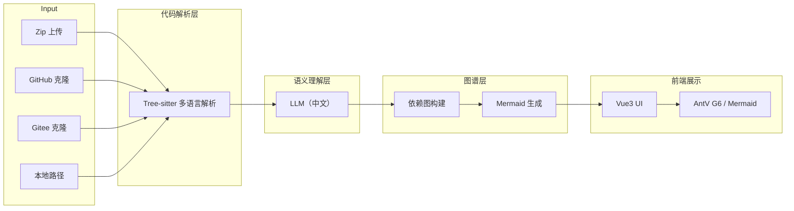

# 项目整体架构概览

本项目旨在构建一个 **多语言代码智能分析 AI Agent**，能够接受本地 Zip 包、GitHub 或 Gitee 仓库链接等多种输入，解析代码结构与函数调用关系，经过 AI 语义理解后生成中文思维导图供非技术人员快速了解项目。

## 关键层次
```
输入层 → 解析层 → 语义层 → 图谱层 → 输出层
```

- **输入层**：上传 Zip、克隆 GitHub/Gitee、解析本地路径。
- **解析层**：基于 **Tree‑sitter** 生成跨语言 AST，抽取函数、类、import、调用等结构信息。
- **语义层**：使用 LLM（OpenAI 或本地模型）对抽取的结构进行中文解释、依赖推理。
- **图谱层**：构建函数/文件/模块的依赖图（统一 JSON），支持 Mermaid、AntV G6 等可视化格式。
- **输出层**：前端 Vue3 页面展示思维导图、代码‑解释联动、交互搜索等。

## 系统组件图（Mermaid）


## 关键技术栈
- **后端**：FastAPI (Python)
  - `tree-sitter` 解析库（Python、JS/TS、Java、Go、Rust 等）
  - LLM 调用（OpenAI API / 本地模型）
  - Graph Service（构建统一 JSON 图谱）
  - Mermaid Service（生成思维导图源码）
- **前端**：Vue3 + Vite
  - AntV G6 / Mermaid 渲染交互图谱
  - 多语言项目结构树展示
- **并发**：`concurrent.futures.ThreadPoolExecutor` 在解析阶段实现多文件并行，降低总体耗时。
- **部署**：Docker Compose 包含 `backend` 与 `frontend` 两个服务，支持水平扩展。

## 数据流（简要描述）
1. 前端上传文件或提交仓库链接 → 后端接收。
2. 统一入口 `parse_project` 根据来源选择相应的 **输入处理**（解压、git clone）。
3. 使用 **并发 Tree‑sitter** 解析每个源码文件，收集结构信息并记录 `size`、`mtime`、`parse_time_ms`（用户要求的额外返回字段）。
4. 将结构化结果发送给 LLM，获取中文描述与依赖推理。 
5. Graph Service 组装 **函数调用图**、**文件依赖图**，输出统一 JSON。 
6. Mermaid Service 将 JSON 转换为 Mermaid 文本。 
7. 前端从后端拉取 Mermaid 文本或直接的 JSON，渲染交互式思维导图。

---

此文件用于统一项目的技术视图，后续设计文档、任务拆分和实现计划均基于此架构进行。
