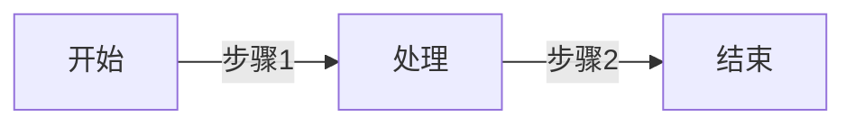
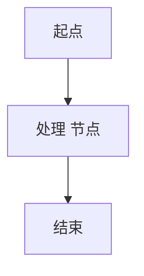

# `/diagram/{project_id}` 接口说明

## 接口概述
- **路径**：`/diagram/{project_id}`
- **方法**：`GET`
- **功能**：根据项目 ID 获取该项目的拓扑结构数据，返回 JSON，前端通过后端的 Mermaid 转换器生成可视化图表。

## JSON 响应格式
```json
{
  "projectId": "string",
  "nodes": [
    {
      "id": "string",
      "label": "string",
      "type": "string"
    }
  ],
  "edges": [
    {
      "source": "string",
      "target": "string",
      "label": "string"
    }
  ]
}
```
- `nodes`：节点数组，每个节点包含唯一 `id`、显示文字 `label`、节点类型 `type`（用于样式区分）。
- `edges`：连线数组，`source` 与 `target` 为对应节点的 `id`，`label` 为连线文字。

## 后端转 Mermaid
后端提供 `/api/diagram/convert`（示例）服务，接受上述 JSON，返回 Mermaid **flowchart** 语法字符串。核心转换逻辑示例：
```ts
function toMermaid(data) {
  const lines = ['graph LR'];
  data.nodes.forEach(n => {
    lines.push(`    ${n.id}["${n.label}"]`);
  });
  data.edges.forEach(e => {
    lines.push(`    ${e.source} -->|"${e.label}"| ${e.target}`);
  });
  return lines.join('\n');
}
```
返回示例：


## 前端 Diagram.vue 使用方法
```vue
<template>
  <div ref="container" class="diagram-container"></div>
</template>

<script setup lang="ts">
import { onMounted, ref } from 'vue';
import G6 from '@antv/g6';
import { fetchDiagram, convertToMermaid } from '@/api/diagram';

const container = ref<HTMLElement | null>(null);

onMounted(async () => {
  const { projectId } = useRoute().params;
  const data = await fetchDiagram(projectId as string);
  const mermaidStr = convertToMermaid(data);
  // 使用 G6 渲染 Mermaid
  const graph = new G6.Graph({
    container: container.value!,
    width: 800,
    height: 600,
    layout: { type: 'dagre' },
    defaultNode: { style: { fill: '#fff', stroke: '#333' } },
    defaultEdge: { style: { endArrow: true } },
  });
  // 这里将 mermaidStr 解析为 G6 所需的节点/连线结构（略）
  graph.data(parseMermaid(mermaidStr));
  graph.render();
});
</script>

<style scoped>
.diagram-container { border: 1px solid #e8e8e8; }
</style>
```
- `fetchDiagram` 调用 `/diagram/{project_id}` 获取原始 JSON。
- `convertToMermaid` 调用后端转换接口得到 Mermaid 文本。
- `parseMermaid` 为自实现的解析函数，将 Mermaid 转为 G6 支持的节点/边数据结构。

## Mermaid 示例（中文字符渲染）

### 中文字符渲染注意事项
- **字体**：确保页面引入支持中文的字体（如 `"Microsoft YaHei"`, `"Noto Sans SC"`），在全局 CSS 中加入：
  ```css
  body { font-family: 'Microsoft YaHei', 'Noto Sans SC', sans-serif; }
  ```
- **AntV G6** 默认使用 Canvas 绘制，中文字符可能出现模糊。可通过设置 `fontFamily` 为上述中文字体并开启 `pixelRatio` 来提升清晰度。
- **Mermaid** 渲染时也会使用相同字体，若使用 `mermaidAPI.render`，请在 `themeCSS` 中覆盖 `font-family`。

---
以上即为 `/diagram/{project_id}` 接口、后端 Mermaid 转换、前端 Diagram.vue 使用以及中文字符渲染要点的完整说明。